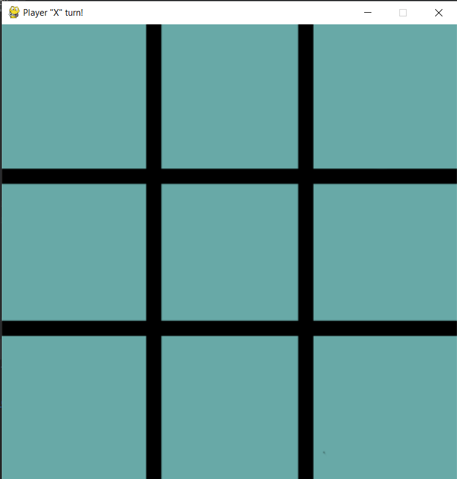
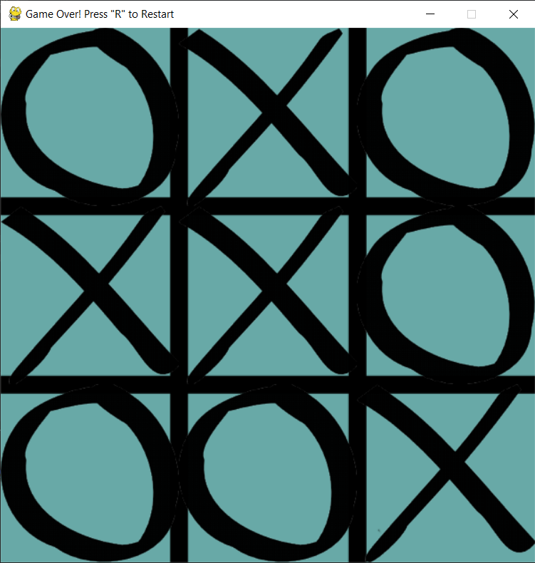
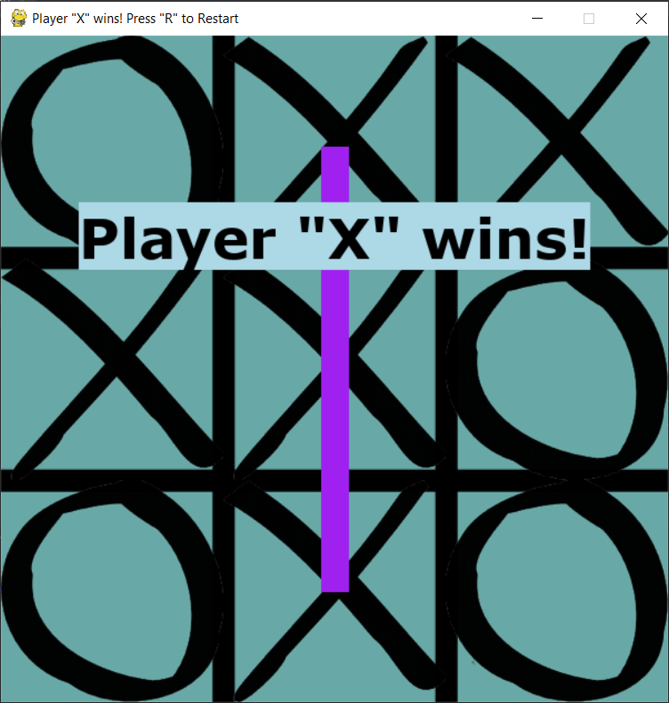

TicTacToe
---
Tic Tac Toe game for 2 players written on python using pygame

---
🎴Overview
---

---
🔨How to compile it
---
So firstly you need to download [python](https://www.python.org/downloads/). Then run Compile.bat and .exe file need to be in one directory with the files folder.

---
❌Builder errors
---
If you have error like this:

How to solve it read [here](https://www.stechies.com/pip-not-recognized-internal-external-command/)

---
📲Contacts
---
__Discord: 𝔰𝔦𝔩𝔳𝔢𝔯 𝔰𝔥𝔞𝔡𝔬𝔴#5304__

---
[go up](#up)

